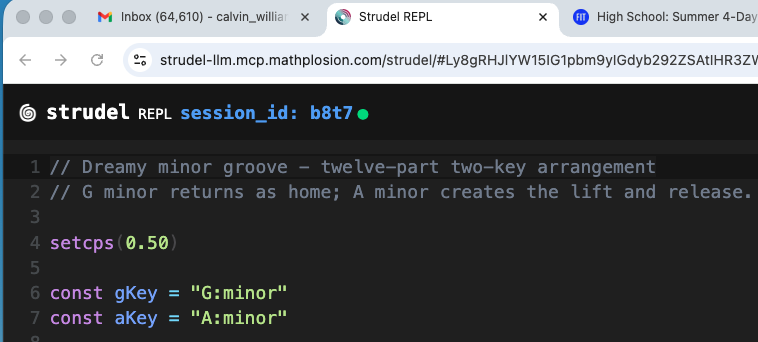
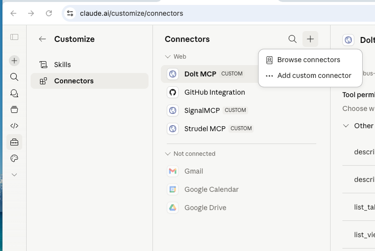
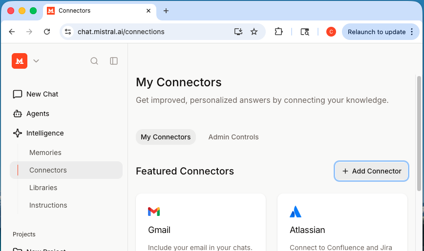

# Strudel LLM Docs

A repository designed for collaborative music composition between humans and LLMs using [Strudel](https://strudel.cc/), a browser-based live coding environment that ports TidalCycles pattern language to JavaScript.

## What This Repo Provides

### The MCP Server and its User Interface

This repo allows you to use a hosted remote MCP server that your LLM can connect to in order to play and edit Strudel compositions in real time. The MCP server is available below and does not need any authentication:

```
https://strudel-llm.mcp.mathplosion.com/sse
```

The server also hosts a User Interface that is here:

```
https://strudel-llm.mcp.mathplosion.com/strudel
```

This User Interface has a session ID that you copy and paste to your LLM so it can communicate with the webpage. The MCP server communicates via websockets to this front-end Strudel web UI, which is a LLM-aware clone of the regular Strudel REPL.

### Tools Available in the MCP Server

It exposes the following tools to your LLM:

- **`play_code`** — send Strudel code to the browser and play it
- **`stop_play`** — stop the current playback
- **`get_currently_playing_code`** — retrieve the code currently in the editor
- **`get_mcp_status`** — check the status of the session

The MCP server and its web UI are described in this repo: https://github.com/calvinw/strudel-llm-mirror

---

## Running in the Github Codespace (or devcontainer)

The easiest way to get started — no local install needed. When the Codespace starts, the Strudel MCP server and composition skills are automatically installed and configured for all AI agents (Claude Code, OpenCode, Gemini, Codex, etc.).

> The devcontainer in this repo inherits its Dockerfile from https://github.com/calvinw/ai-agentic-tools — see there for more info on the agentic tools container idea.

### Step 1
Go to https://github.com/calvinw/strudel-llm-docs and create a Codespace on the repo.

### Step 2
In a separate browser window, open the Strudel UI:
https://strudel-llm.mcp.mathplosion.com/strudel

This is the UI part of the Strudel MCP server that the LLM will communicate with to play compositions. It is a LLM-aware clone of the regular Strudel REPL.

### Step 3
In the Codespace terminal, start Claude Code or OpenCode:
```
% claude.sh      # this runs a yolo version of claude, you can just type "claude" if you like
```
or
```
% opencode.sh    # this runs a yolo version of opencode, you can just type "opencode" if you like
```

### Step 4
Copy the **session ID** shown in the Strudel window (e.g., `b8t7`) and paste it into Claude Code or OpenCode.



### Step 5
Ask it to play you some Strudel music!

---

## Using Online Strudel Docs As Examples

You can paste any Strudel documentation page anywhere on the web into Claude Code or OpenCode, etc and ask it to play the examples from that webpage - a great way to learn Strudel interactively. For example try this:
- https://strudel.cc/workshop/getting-started/

---

## Running Locally Using Claude Code, OpenCode, etc.

### Step 1
Clone the repository and enter it:
```bash
git clone https://github.com/calvinw/strudel-llm-docs.git
cd strudel-llm-docs
```

### Step 2
Connect the Strudel MCP server.

The project includes a `.mcp.json` file that **Claude Code picks up automatically** — no extra install needed. Just start Claude Code from inside the project directory.

For **OpenCode** (or to install explicitly for Claude Code), run the install script:
```bash
./local-setup/install_strudel_mcp_claude.sh
```

This registers the remote MCP server at:
```
https://strudel-llm.mcp.mathplosion.com/sse
```

### Step 3
Install the composition skills (so `/anchor-framework` and `/syncopations` work in your AI tool):
```bash
./local-setup/install_skills.sh
```

### Step 4
In a separate browser window, open the Strudel UI:
https://strudel-llm.mcp.mathplosion.com/strudel

### Step 5
Start your AI coding tool from inside the project directory:
```
% claude
```
or
```
% opencode
```

### Step 6
Copy the **session ID** from the Strudel window and paste it in.

### Step 7
Ask it to play you some Strudel music!

---

## Running as a Connector in Claude.ai or Mistral.ai

Both Claude.ai and Mistral.ai support remote MCP servers as connectors, letting you use the Strudel MCP directly from the chat UI — no terminal required.

Add the following SSE URL as a connector/MCP server in your Claude.ai or Mistral.ai settings:
```
https://strudel-llm.mcp.mathplosion.com/sse
```

### Claude.ai



### Mistral.ai

Here is a video showing how to set up the Mistral.ai connector:
https://youtu.be/bZR2ctE2LyQ?si=YUighkD7GI3-PkOe



Then open the Strudel UI in another window, copy the session ID, and paste it into the chat. From there the workflow is the same — ask it to play Strudel music!

---

## Composition Skills

This repo includes two composition skills in `.skillshare/skills/` that are automatically available in your AI tool once installed. Trigger them with a slash command:

### `/anchor-framework KEY`

Guides your LLM through building a Strudel composition step by step using the **Anchor Framework** — a 4-instrument stack where two instruments play a 4-step harmonic progression and two play 12-step melodies that lock onto the harmony every 3rd step (the "anchor points"). The skill walks through all 5 development stages from bare piano chords to a full arrangement with syncopation, effects, and drums.

Example: `/anchor-framework E:minor`

See: [`.skillshare/skills/anchor-framework/SKILL.md`](.skillshare/skills/anchor-framework/SKILL.md)

### `/syncopations`

Returns the standard set of mini-notation rhythm transforms used to add syncopation to note patterns — delayed entries, early cutoffs, and held notes. Used as a reference within the anchor-framework workflow.

Example: `/syncopations`

See: [`.skillshare/skills/syncopations/SKILL.md`](.skillshare/skills/syncopations/SKILL.md)

---

## Working with Skills

All skill editing happens in `.skillshare/skills/`. Never edit agent config directories (`.claude/`, `.opencode/`, etc.) directly — those are managed automatically by `skillshare sync`.

After editing any skill, run:

```bash
skillshare sync
```

This propagates your changes to all configured AI tools (Claude Code, OpenCode, Gemini, Codex, etc.).

It is recommended to use the **skillshare CLI** to manage skills:
- CLI repo: https://github.com/runkids/skillshare
